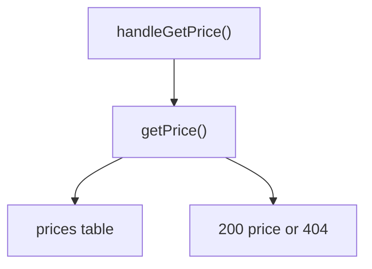

# Catalog

This block reads product prices from the `prices` table and serves one price lookup route. [verified: src/catalog/prices.ts::getPrice()]

## Boundary

The block owns the price read queries and the lookup route. The database client interface in `src/db/` and the billing code in `src/billing/` are outside this block and have no block page in this tree. [verified: src/catalog/prices.ts::"../db/client"]

## Owned sources

| Source | Role | Evidence |
|---|---|---|
| `src/catalog/prices.ts` | Price read queries | `[verified]` |
| `src/catalog/routes.ts` | Price lookup route | `[verified]` |

## Dependencies

The block calls the `Db` interface from `src/db/client.ts`, which has no block page yet. [verified: src/db/client.ts::Db]

## Intra-block flow

