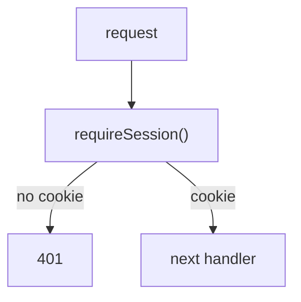

# HTTP auth middleware

This block provides the request middleware that guards protected routes with a session cookie. [verified: src/middleware/session.ts::requireSession()]

## Boundary

The block owns the middleware and its request types. The routes that mount it live in `src/account/`, which has no block page in this tree. [verified: src/account/routes.ts::accountRoutes]

## Owned sources

| Source | Role | Evidence |
|---|---|---|
| `src/middleware/session.ts` | Session middleware and cookie name | `[verified]` |
| `src/middleware/types.ts` | Request, response, and next types | `[verified]` |

## Dependencies

This block has no documented dependencies. [verified: src/middleware/session.ts::"./types"]

## Intra-block flow

