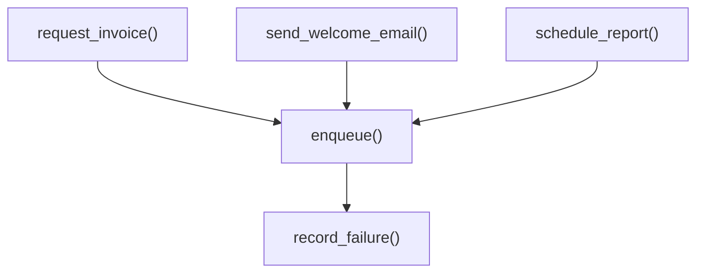

# Jobs

This block holds an in-process job queue and the producers that add invoice, email, and report jobs to it. [verified: src/jobs/queue.py::enqueue()]

## Boundary

The block owns the queue, its retry limit, and three producer modules. No worker loop exists in this source tree. [verified: src/jobs/queue.py::record_failure()]

scope: `git grep -n "record_failure" <pin> -- src/` (defined in queue.py, no caller)

## Owned sources

| Source | Role | Evidence |
|---|---|---|
| `src/jobs/queue.py` | Queue, deduplication index, retry limit | `[verified]` |
| `src/jobs/producers/invoice.py` | Invoice render producer | `[verified]` |
| `src/jobs/producers/email.py` | Welcome email producer | `[verified]` |
| `src/jobs/producers/report.py` | Report build producer | `[verified]` |

## Dependencies

This block has no documented dependencies. [verified: src/jobs/producers/email.py::"from jobs.queue import enqueue"]

## Intra-block flow

