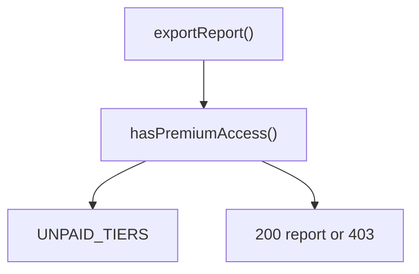

# Entitlements

This block decides which accounts may use premium features and gates the report export route on that decision. [verified: src/entitlements/access.ts::hasPremiumAccess()]

## Boundary

The block owns the tier model, the access predicate, and the export route. Account storage is outside this source tree. [verified: src/entitlements/tiers.ts::Account]

## Owned sources

| Source | Role | Evidence |
|---|---|---|
| `src/entitlements/tiers.ts` | Tier type, account shape, unpaid tier set | `[verified]` |
| `src/entitlements/access.ts` | Premium access predicate | `[verified]` |
| `src/entitlements/routes.ts` | Report export route | `[verified]` |

## Dependencies

This block imports only its own files, so it has no documented dependencies. [verified: src/entitlements/access.ts::"./tiers"]

scope: `git grep -n "import" <pin> -- src/` (all imports are relative to src/entitlements/)

## Intra-block flow

