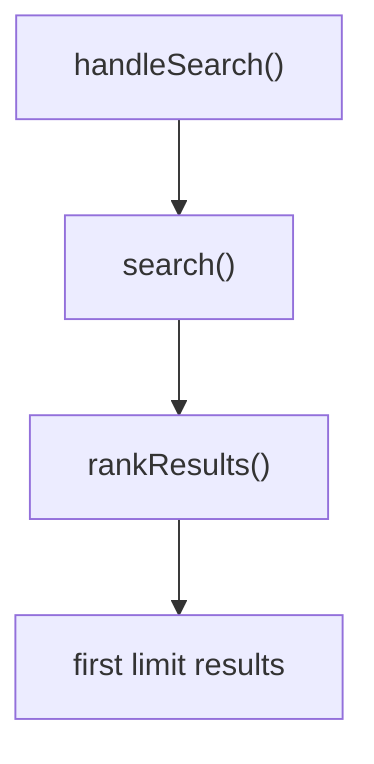

# Search

This block matches a query against an in-memory item index, ranks the matches by score, and serves them from one route. [verified: src/search/service.ts::search()]

## Boundary

The block owns item matching, ranking, the result limit, and the search route. Building the index is outside this source tree. [verified: src/search/routes.ts::handleSearch()]

## Owned sources

| Source | Role | Evidence |
|---|---|---|
| `src/search/types.ts` | Item shape | `[verified]` |
| `src/search/filters.ts` | Visibility filter helpers | `[verified]` |
| `src/search/service.ts` | Matching, ranking, limit | `[verified]` |
| `src/search/routes.ts` | Search route | `[verified]` |

## Dependencies

This block has no documented dependencies. [verified: src/search/routes.ts::"./service"]

## Intra-block flow

