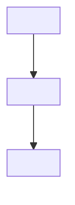

# <Block name>

<!-- State this block's purpose and boundary in tagged sentences. -->

## Boundary

<!-- State what this block owns and what remains owned by a linked block. -->

## Owned sources

<!-- List every disjoint file, directory, or prefix from owns with its role. -->

| Source | Role | Evidence |
|---|---|---|
| `<owned-source-path>` | `<role>` | `[<evidence-tag>]` |

## Dependencies

<!-- State the consequence of each dependency and link to its owner rather than restating its mechanism. -->

| Block | Consequence | Evidence |
|---|---|---|
| [`<docs-relative-block-id>`](<relative-link-to-owner-README>) | `<consequence>` | `[<evidence-tag>]` |

## Intra-block flow

<!-- Keep one mermaid diagram for this block's own flow and do not repeat the system diagram. -->

