# System data flow

<!-- Summarize the complete system flow in tagged sentences before the diagram. -->

## Whole-system flow

```mermaid
flowchart TD
    A["<input>"] --> B["<block or boundary>"]
    B --> C["<output>"]
```

<!-- Keep one mermaid diagram here and link to block READMEs for internal detail. -->

## Ownership of hops

<!-- Name the block that owns each meaningful hop and link to its documentation. -->

| Hop | Owning block | Evidence |
|---|---|---|
| `<source> to <destination>` | [`<block>`](<docs-relative-id>/README.md) | `[<evidence-tag>]` |
